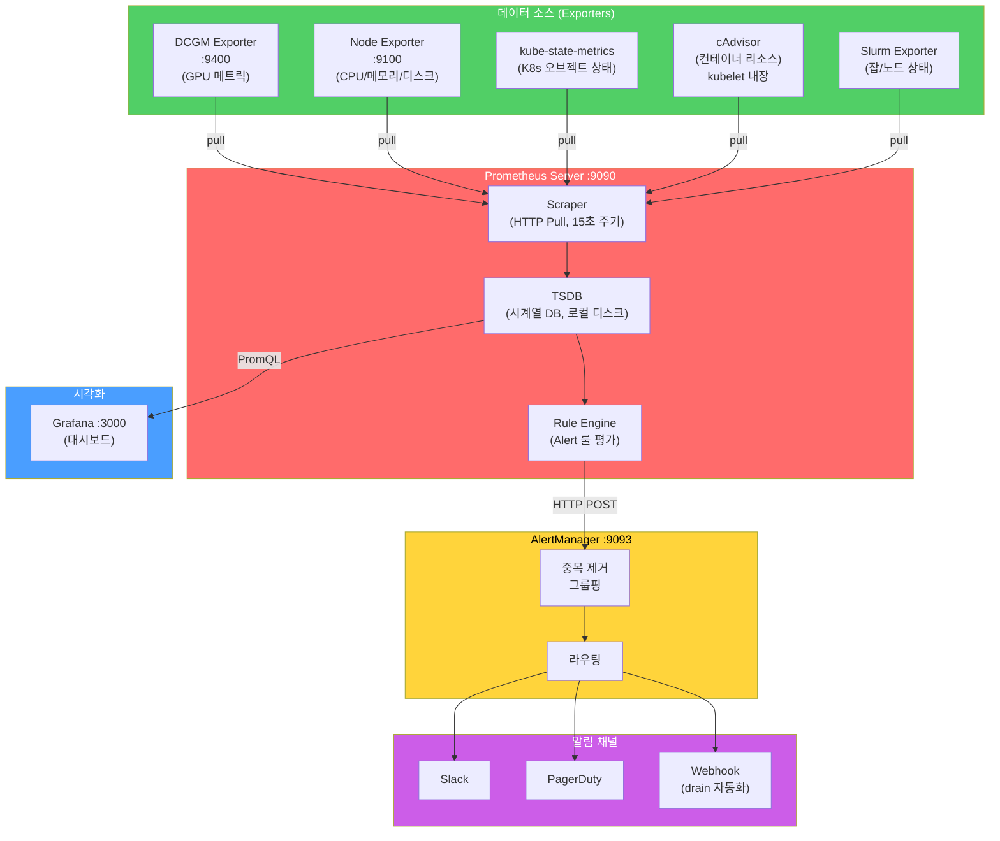

# slurm-on-aws (pcluster)


* [C1. VPC 생성](https://github.com/gnosia93/slurm-on-aws/blob/main/lesson/1-vpc.md)

* [C2. 스토리지 및 네트워크 구성](https://github.com/gnosia93/slurm-on-aws/blob/main/lesson/9-shared-fs.md)

* [C3. Parallel Cluster 설치](https://github.com/gnosia93/slurm-on-aws/blob/main/lesson/2-pcluster.md) 

* [C4. nccl-test 실행하기](https://github.com/gnosia93/slurm-on-aws/blob/main/lesson/3-nccl-test.md) 
    
* [C5. 클러스터 진단](https://github.com/gnosia93/slurm-on-aws/blob/main/lesson/4-system-diag.md)   
     
* [C6. 컨테이너 사용하기 (enroot/pyxis)](https://github.com/gnosia93/slurm-on-aws/blob/main/lesson/5-slurm-container.md)

* > [C7. Custom AMI 만들기 (packer)](https://github.com/gnosia93/slurm-on-aws/blob/main/lesson/6-custom-ami.md)
  
* [C8. 모니터링 설정하기 (prometheus/loki/grafana)](https://github.com/gnosia93/slurm-on-aws/blob/main/lesson/7-monitoring.md)

* [C9. Megatron-LM](https://github.com/gnosia93/slurm-on-aws/blob/main/lesson/8-megatron-lm.md)
  
* [C10. 클러스터 변경 / 삭제](https://github.com/gnosia93/slurm-on-aws/blob/main/lesson/10-cluster-delete.md)


### _Appendix_ ##
* [C11. Slurm 의 이해](https://github.com/gnosia93/slurm-on-aws/blob/main/lesson/11-slurm-deepdive.md)
* [A. DCGM 메트릭](https://github.com/gnosia93/slurm-on-aws/blob/main/lesson/a2-dcgm-metric.md)
* [B. GPU OOM 대응](https://github.com/gnosia93/slurm-on-aws/blob/main/lesson/a3-gpu-oom.md)
* [C. CPU OOM 대응](https://github.com/gnosia93/slurm-on-aws/blob/main/lesson/a4-cpu-oom.md)
* [D. Straggler Detection](https://github.com/gnosia93/slurm-on-aws/blob/main/lesson/a5-staggler-detect.md)
* [E. 좀비 프로세스 방지](https://github.com/gnosia93/slurm-on-aws/blob/main/lesson/a6-zombie-detect.md)


  
### _AWS P-Instance Architecture_ ###


* Job 설정
```
# 1. GRES (Generic Resources) - GPU 할당
#SBATCH --gpus-per-node=2          # 노드당 GPU 2장 요청

# 2. CPU-GPU affinity
#SBATCH --gpu-bind=closest         # GPU와 가장 가까운 CPU 코어에 바인딩, cf> gpus-per-node=8 인 경우는 의미 없음.

# 3. 네트워크 토폴로지 
#SBATCH --switches=1@00:10:00      # 온프람인 경우 - 1는 TOR 스위치 하나의 의미, 할당될때 까지 10분까지 기다릴수 있음.
                                   # AWS 인 경우 - Placement Group 으로 처리, PCluster 생성시 설정해야 함. PlacementGroup.Enabled: true  

#SBATCH --exclusive                # 노드 독점 (다른 잡과 공유 안 함)
```
* NIC 의 경우 NCCL 알아서 가까운 경로에 있는 NIC을 사용한다.
```
# slurm.conf
# topology.conf - 네트워크 토폴로지 정의
# On-Prom 에 해당, AWS 의 경우 PlacementGroup 으로 대체
TopologyPlugin=topology/tree

# gres.conf - p5en.48xlarge (8× H200, 듀얼 소켓)
# NUMA 0 — CPU Socket 0 (Cores 0-47)
Name=gpu Type=h200 File=/dev/nvidia0 Cores=0-47
Name=gpu Type=h200 File=/dev/nvidia1 Cores=0-47
Name=gpu Type=h200 File=/dev/nvidia2 Cores=0-47
Name=gpu Type=h200 File=/dev/nvidia3 Cores=0-47

# NUMA 1 — CPU Socket 1 (Cores 48-95)
Name=gpu Type=h200 File=/dev/nvidia4 Cores=48-95
Name=gpu Type=h200 File=/dev/nvidia5 Cores=48-95
Name=gpu Type=h200 File=/dev/nvidia6 Cores=48-95
Name=gpu Type=h200 File=/dev/nvidia7 Cores=48-95
```



## See Also ##

* [slurm-on-ec2 with ansible](https://github.com/gnosia93/slurm-on-ec2)
* [slurm-on-eks with slinky](https://github.com/gnosia93/slurm-on-eks)
