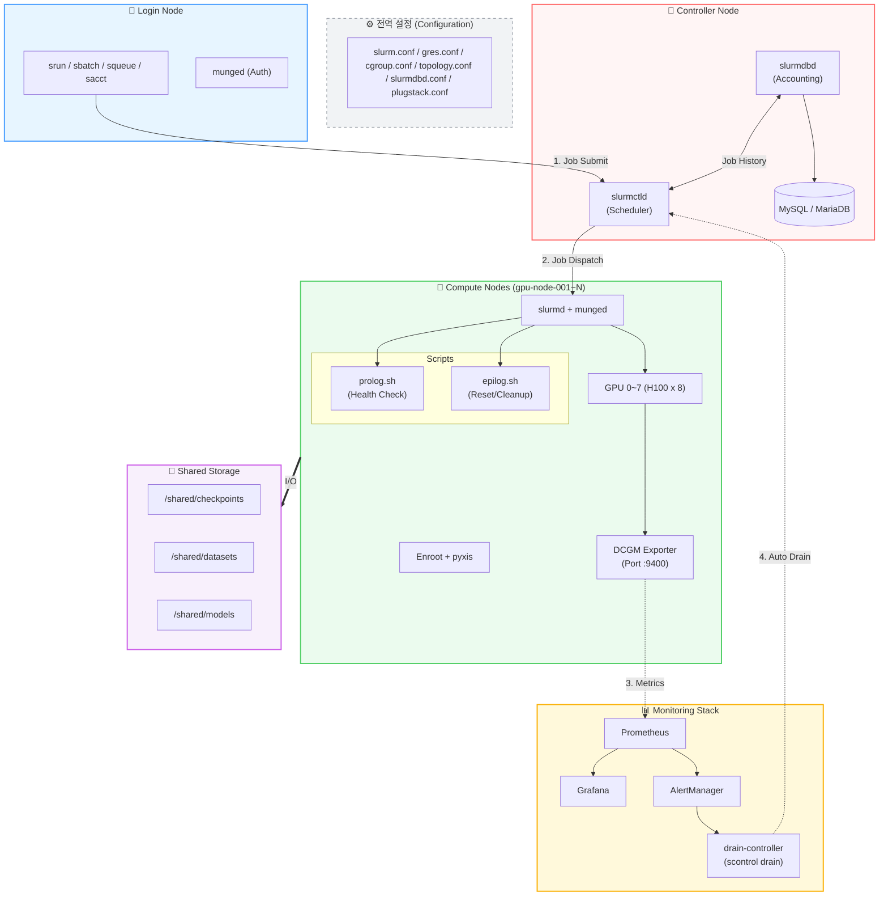

## Architecture ##




## Configuration ##

ParallelCluster 의 설정 파일은 온프램 slurm(/etc/slurm/) 와 달리 /opt/slurm/etc/ 에 있다. 

* [slurm.conf 샘플](https://github.com/gnosia93/slurm-on-aws/blob/main/lesson/conf/slurm.conf)
* [gres.conf 샘플](https://github.com/gnosia93/slurm-on-aws/blob/main/lesson/conf/gres.conf)
* [cgroup.conf 샘플](https://github.com/gnosia93/slurm-on-aws/blob/main/lesson/conf/cgroup.conf)
* [prolog.sh 샘플](https://github.com/gnosia93/slurm-on-aws/blob/main/lesson/conf/prolog.sh)
* [epilog.sh 샘플](https://github.com/gnosia93/slurm-on-aws/blob/main/lesson/conf/epilog.sh)

## CUDA and Architecture Matrix ##
* https://docs.nvidia.com/datacenter/tesla/drivers/cuda-toolkit-driver-and-architecture-matrix.html

Software 구성
```
호스트 (Compute Node)
  └─ NVIDIA Driver (커널 모듈)     ← 호스트에만 설치

컨테이너 (NGC)
  ├─ CUDA Toolkit
  ├─ cuDNN
  ├─ NCCL
  ├─ PyTorch
  └─ NVIDIA Driver 없음 → 호스트 드라이버를 마운트해서 사용
```
CUDA Toolkit
```
CPU 코드 (Python/C++)
    │
    ▼
CUDA API (cuda, cudnn, cublas 등)
    │
    ▼
NVIDIA Driver (커널 모듈)
    │
    ▼
GPU 하드웨어
```

## slurm 명령어 ##
```
# ============================================
# 잡 제출/실행
# ============================================
sbatch train.sh                              # 배치 잡 제출
srun --gres=gpu:1 nvidia-smi                 # 인터랙티브 실행
srun --gres=gpu:1 --pty bash                 # GPU 노드 셸 접속
salloc --nodes=2 --gres=gpu:8               # 노드 할당 (디버깅용)

# ============================================
# 잡 모니터링
# ============================================
squeue                                       # 전체 잡 조회
squeue -u $USER                              # 내 잡만
squeue -j 12345                              # 특정 잡
scontrol show job 12345                      # 잡 상세 정보

# ============================================
# 잡 제어
# ============================================
scancel 12345                                # 잡 취소
scancel -u $USER                             # 내 잡 전부 취소
scontrol hold 12345                          # 잡 홀드
scontrol release 12345                       # 잡 홀드 해제
scontrol requeue 12345                       # 잡 재큐잉
scontrol update job 12345 TimeLimit=48:00:00 # 시간 연장

# ============================================
# 클러스터/노드 정보
# ============================================
sinfo                                        # 파티션/노드 상태
sinfo -N -l                                  # 노드별 상세
sinfo -o "%N %G %C %t"                       # 노드별 GPU/CPU/상태
scontrol show node gpu-node-01               # 노드 상세
scontrol show partition                      # 파티션 설정

# ============================================
# 노드 관리 (관리자)
# ============================================
scontrol update node=gpu-node-05 state=drain reason="GPU ECC error"
scontrol update node=gpu-node-05 state=resume
scontrol reconfigure                         # slurm.conf 리로드

# ============================================
# 잡 이력/어카운팅
# ============================================
sacct -j 12345                               # 잡 이력
sacct -u $USER --starttime=2026-03-01        # 기간별 이력
sacct -j 12345 --format=JobID,JobName,State,ExitCode,Elapsed,MaxRSS
seff 12345                                   # 잡 효율성 (CPU/메모리 사용률)

# ============================================
# 어카운트/유저 관리 (관리자)
# ============================================
sacctmgr add account team-a                  # 어카운트 생성
sacctmgr add user <os-user> Account=team-a   # 유저 추가
sacctmgr add qos high MaxTRESPerUser=gres/gpu=32 Priority=100
sacctmgr show account                        # 어카운트 조회
sacctmgr show qos                            # QOS 조회

# ============================================
# GPU 학습 sbatch 템플릿
# ============================================
#!/bin/bash
#SBATCH --job-name=llm-train
#SBATCH --nodes=4
#SBATCH --ntasks-per-node=8
#SBATCH --gres=gpu:8
#SBATCH --partition=gpu
#SBATCH --time=72:00:00
#SBATCH --output=%x_%j.log
#SBATCH --exclusive
#SBATCH --requeue

srun torchrun \
  --nproc_per_node=8 \
  --nnodes=$SLURM_NNODES \
  --rdzv_backend=c10d \
  --rdzv_endpoint=$(scontrol show hostnames $SLURM_NODELIST | head -n1):29500 \
  train.py
```
