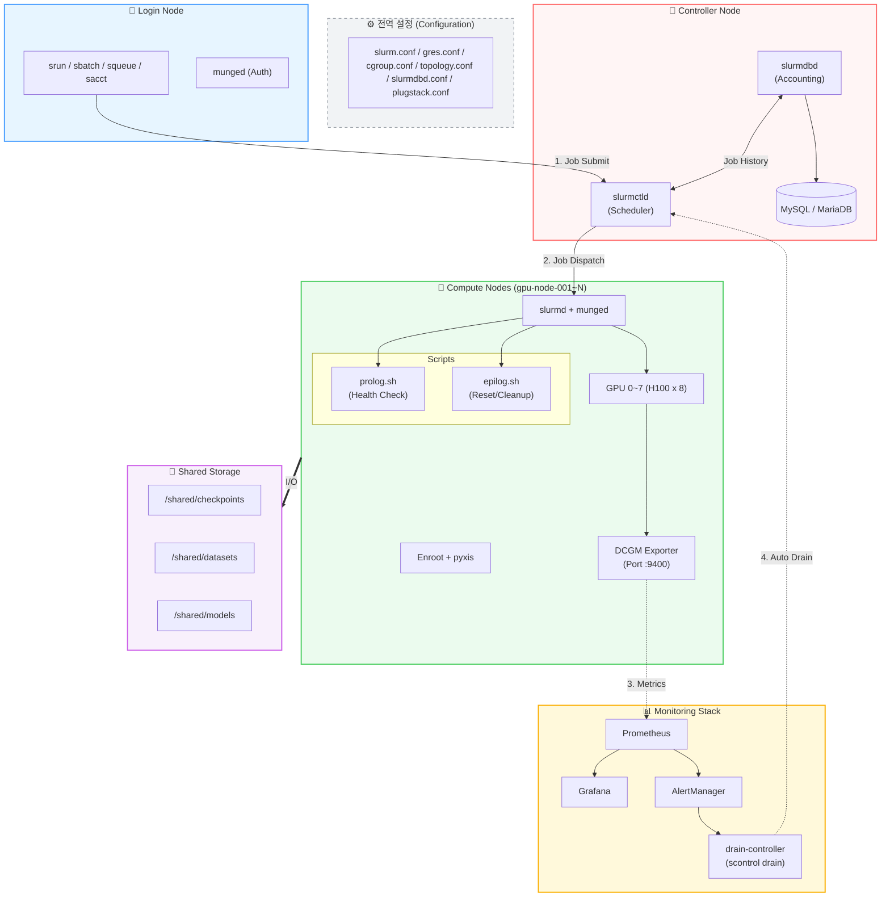
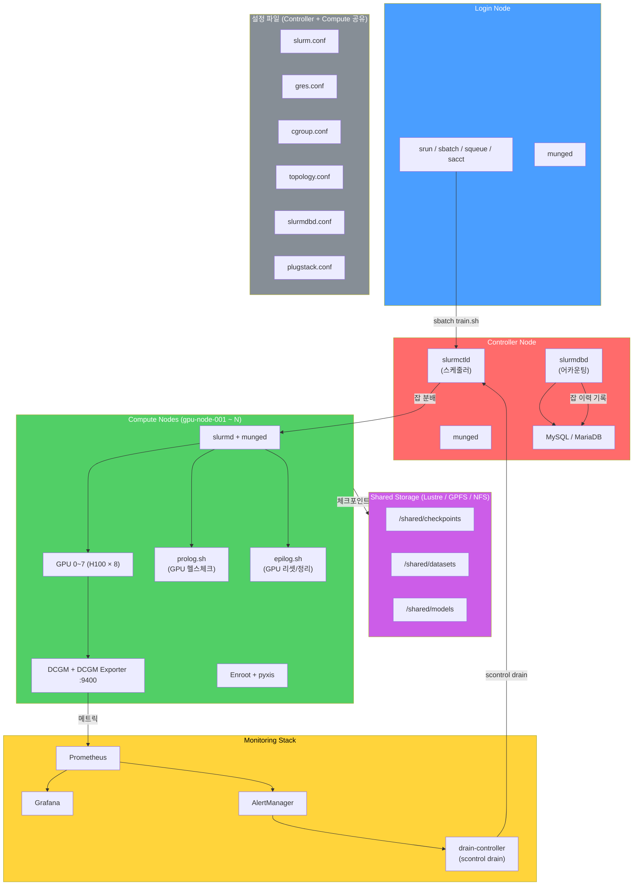

## Architecture ##

## Configuration ##

ParallelCluster 의 설정 파일은 온프램 slurm(/etc/slurm/) 와 달리 /opt/slurm/etc/ 에 있다. 

* [slurm.conf 샘플](https://github.com/gnosia93/slurm-on-aws/blob/main/lesson/conf/slurm.conf)
* [gres.conf 샘플](https://github.com/gnosia93/slurm-on-aws/blob/main/lesson/conf/gres.conf)
* [cgroup.conf 샘플](https://github.com/gnosia93/slurm-on-aws/blob/main/lesson/conf/cgroup.conf)
* [prolog.sh 샘플](https://github.com/gnosia93/slurm-on-aws/blob/main/lesson/conf/prolog.sh)
* [epilog.sh 샘플](https://github.com/gnosia93/slurm-on-aws/blob/main/lesson/conf/epilog.sh)
