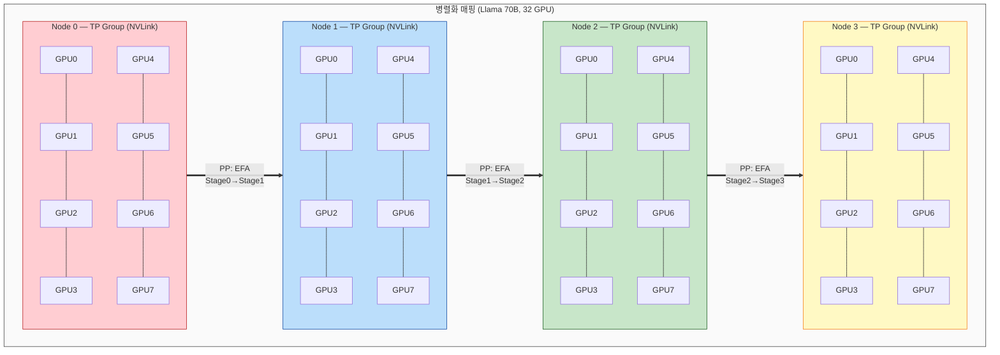

## [Megatron-LM](https://arxiv.org/pdf/1909.08053) ##

NVIDIA가 개발한 대규모 언어 모델 학습 프레임워크로, 수천 대의 GPU에서 수십~수백 billion 파라미터 규모의 Transformer 모델을 효율적으로 학습시키기 위해 만들어졌다. 2019년 NVIDIA 연구팀이 Tensor Parallelism 논문과 함께 처음 공개했고, 이후 Pipeline Parallelism, Sequence Parallelism, Context Parallelism, Expert Parallelism까지 점진적으로 추가되면서 현재는 DP, TP, PP, SP, CP, EP 6가지 병렬화를 동시에 조합할 수 있는 이른바 6D Parallelism을 지원한다.  

핵심 설계 철학은 "모델 아키텍처를 코드로 짜지 않고 CLI 파라미터로 설정한다"는 것으로, num-layers, hidden-size, num-attention-heads, ffn-hidden-size 같은 하이퍼파라미터만 지정하면 Transformer 구조가 자동으로 구성되고, SwiGLU, GQA, RoPE, RMSNorm, FlashAttention, MoE 같은 최신 기법들도 전부 플래그 하나로 켜고 끌 수 있다. 

학습 파이프라인은 크게 3단계로 구성되는데, 먼저 preprocess_data.py로 JSONL 형태의 원본 텍스트를 토큰화하여 바이너리 포맷으로 변환하고, 그 다음 pretrain_gpt.py를 torchrun이나 Slurm sbatch로 실행하여 분산 학습을 수행하며, 학습 중 주기적으로 체크포인트를 저장한다.  
내부 구조를 보면 pretrain_gpt.py가 진입점이고, 이 안에서 megatron-core 라이브러리의 GPTModel, TransformerLayer, Attention, MLP 등의 모듈을 조립한다. 실제 병렬화 로직은 megatron-core에 구현되어 있어서, TP는 가중치 행렬을 column-wise로 분할하고 All-Reduce로 동기화하며, PP는 레이어를 스테이지별로 나누어 마이크로배치 파이프라이닝으로 bubble을 줄이고, SP는 LayerNorm과 Dropout을 시퀀스 차원으로 분할하여 TP와 함께 메모리를 절감한다.


### Megatron-LM 예시 ###
```
python pretrain_gpt.py \
  --tensor-model-parallel-size 8 \     # TP=8 (노드 내 GPU 8장)
  --pipeline-model-parallel-size 4 \   # PP=4 (4개 스테이지)
  --sequence-parallel \                # SP 활성화
  --context-parallel-size 2 \          # CP=2
  --expert-model-parallel-size 4 \     # EP=4 (MoE 모델일 때)
  --data-parallel-size 8 \             # DP=8
  --num-layers 80 \
  --hidden-size 8192 \
  --num-attention-heads 64 \
  --micro-batch-size 1 \
  --global-batch-size 1024
```
* 총 GPU = TP × PP × DP x CP x EP = 8 × 4 × 8 x 2 x 4 = 2048 GPU


### Framework / API 비교 ###

* Megatron-LM: 모델을 쪼개는 데 특화 (TP/PP). GPU 효율 최고
* DeepSpeed: 메모리를 아끼는 데 특화 (ZeRO). 적은 GPU로 큰 모델
* FSDP: 가장 쉬움. 중소 규모 학습에 적합
```
[소규모: GPU 1~8장]
→ PyTorch FSDP 또는 DeepSpeed ZeRO

[중규모: GPU 8~64장]
→ DeepSpeed ZeRO + TP

[대규모: GPU 64~수천장]
→ Megatron-LM (TP + PP + DP)
   또는 Megatron-DeepSpeed (Megatron의 TP/PP + DeepSpeed의 ZeRO)
```

### DP 사이즈 설계 ###
```
Llama 3 405B 학습 (Meta):
TP=8 × PP=16 × DP=? = 16,384 GPU
→ DP = 16384 / (8×16) = 128

GPT-4 급 (추정):
TP=8 × PP=8 × DP=? = 25,000+ GPU
→ DP = 수백
```

* DP 사이즈가 크면 배치 사이즈가 커짐 → 학습 step 수 줄어듦 → 학습 시간 단축
* DP 증가는 gradient All-Reduce 통신량 증가 (대역폭 병목)
* 배치가 너무 커지면 학습 수렴이 불안정해질 수 있음

DP 사이즈 계산시 global batch size를 먼저 정하고, 거기서 역산한다.
```
global_batch_size = micro_batch_size × DP × gradient_accumulation_steps

예: global_batch=1024, micro_batch=1, grad_accum=4
→ DP = 1024 / (1 × 4) = 256
```
* DP=16~32 정도면 중규모, 100+ 이면 대규모 학습

## 훈련하기 ##

### 데이터 전처리 ###
```
# Megatron-LM 클론
git clone https://github.com/NVIDIA/Megatron-LM.git
cd Megatron-LM

# 학습 데이터를 Megatron 포맷으로 변환 (jsonl → .bin + .idx)
python tools/preprocess_data.py \
  --input training_data.jsonl \
  --output-prefix my-gpt \
  --tokenizer-type GPT2BPETokenizer \
  --vocab-file gpt2-vocab.json \
  --merge-file gpt2-merges.txt \
  --workers 32 \
  --append-eod

# 결과: my-gpt_text_document.bin, my-gpt_text_document.idx
```

### train command 쉘 ###
```
#!/bin/bash
# pretrain.sh

# 클러스터 설정
NNODES=16                    # 노드 수
GPUS_PER_NODE=1              # 노드당 GPU
WORLD_SIZE=$((NNODES * GPUS_PER_NODE))  # 총 16 GPU

# 병렬화 설정
TP=2
PP=8
DP=$((WORLD_SIZE / (TP * PP)))  # 16 / 16 = 1

# 모델 설정
NUM_LAYERS=80
HIDDEN_SIZE=8192
NUM_ATTENTION_HEADS=64
SEQ_LENGTH=4096
MICRO_BATCH_SIZE=1
GLOBAL_BATCH_SIZE=1024

# 데이터 경로
DATA_PATH="my-gpt_text_document"
TOKENIZER_PATH="gpt2-vocab.json"
MERGE_PATH="gpt2-merges.txt"
CHECKPOINT_PATH="checkpoints/gpt-80layer"

# 분산 실행 (torchrun)
torchrun \
  --nproc_per_node $GPUS_PER_NODE \
  --nnodes $NNODES \
  --node_rank $SLURM_NODEID \
  --master_addr $MASTER_ADDR \
  --master_port 6000 \
  pretrain_gpt.py \
  \
  --tensor-model-parallel-size $TP \
  --pipeline-model-parallel-size $PP \
  --sequence-parallel \
  --context-parallel-size 2 \
  \
  --num-layers $NUM_LAYERS \
  --hidden-size $HIDDEN_SIZE \
  --num-attention-heads $NUM_ATTENTION_HEADS \
  --seq-length $SEQ_LENGTH \
  --max-position-embeddings $SEQ_LENGTH \
  \
  --micro-batch-size $MICRO_BATCH_SIZE \
  --global-batch-size $GLOBAL_BATCH_SIZE \
  \
  --train-iters 100000 \
  --lr 1.5e-4 \
  --min-lr 1.5e-5 \
  --lr-decay-style cosine \
  --lr-warmup-iters 2000 \
  --weight-decay 0.1 \
  --clip-grad 1.0 \
  \
  --fp16 \
  --initial-loss-scale 4096 \
  \
  --data-path $DATA_PATH \
  --vocab-file $TOKENIZER_PATH \
  --merge-file $MERGE_PATH \
  --split 98,2,0 \
  \
  --save $CHECKPOINT_PATH \
  --save-interval 1000 \
  --load $CHECKPOINT_PATH \
  \
  --log-interval 10 \
  --eval-interval 500 \
  --eval-iters 50 \
  \
  --distributed-backend nccl \
  --use-flash-attn
```





```mermaid
graph TB
    subgraph CLUSTER["g7e.4xlarge × 16 — 65B 모델 학습 (TP=2, PP=8, DP=1)"]

        subgraph CONFIG["설정"]
            CFG["16 Nodes × 1 GPU (96GB VRAM) = 16 GPU<br/>TP=2 | PP=8 | DP=1<br/>Layers=80 | Hidden=8192 | Heads=64<br/>GPU당 메모리: ~85GB / 96GB"]
        end

        subgraph PP["PP 파이프라인 (8 Stage × 10 Layers each)"]

            subgraph S0["Stage 0 — Layer 0-9"]
                subgraph TP0["TP=2 (EFA)"]
                    N0["Node 0<br/>RTX PRO 6000<br/>96GB"]
                    N1["Node 1<br/>RTX PRO 6000<br/>96GB"]
                end
                N0 <-->|"TP All-Reduce<br/>EFA"| N1
            end

            subgraph S1["Stage 1 — Layer 10-19"]
                subgraph TP1["TP=2 (EFA)"]
                    N2["Node 2<br/>96GB"]
                    N3["Node 3<br/>96GB"]
                end
                N2 <-->|"TP All-Reduce<br/>EFA"| N3
            end

            subgraph S2["Stage 2 — Layer 20-29"]
                subgraph TP2["TP=2 (EFA)"]
                    N4["Node 4<br/>96GB"]
                    N5["Node 5<br/>96GB"]
                end
                N4 <-->|"TP All-Reduce<br/>EFA"| N5
            end

            subgraph S3["Stage 3 — Layer 30-39"]
                subgraph TP3["TP=2 (EFA)"]
                    N6["Node 6<br/>96GB"]
                    N7["Node 7<br/>96GB"]
                end
                N6 <-->|"TP All-Reduce<br/>EFA"| N7
            end

            subgraph S4["Stage 4 — Layer 40-49"]
                subgraph TP4["TP=2 (EFA)"]
                    N8["Node 8<br/>96GB"]
                    N9["Node 9<br/>96GB"]
                end
                N8 <-->|"TP All-Reduce<br/>EFA"| N9
            end

            subgraph S5["Stage 5 — Layer 50-59"]
                subgraph TP5["TP=2 (EFA)"]
                    N10["Node 10<br/>96GB"]
                    N11["Node 11<br/>96GB"]
                end
                N10 <-->|"TP All-Reduce<br/>EFA"| N11
            end

            subgraph S6["Stage 6 — Layer 60-69"]
                subgraph TP6["TP=2 (EFA)"]
                    N12["Node 12<br/>96GB"]
                    N13["Node 13<br/>96GB"]
                end
                N12 <-->|"TP All-Reduce<br/>EFA"| N13
            end

            subgraph S7["Stage 7 — Layer 70-79"]
                subgraph TP7["TP=2 (EFA)"]
                    N14["Node 14<br/>96GB"]
                    N15["Node 15<br/>96GB"]
                end
                N14 <-->|"TP All-Reduce<br/>EFA"| N15
            end

        end

        S0 ==>|"PP P2P<br/>EFA"| S1
        S1 ==>|"PP P2P"| S2
        S2 ==>|"PP P2P"| S3
        S3 ==>|"PP P2P"| S4
        S4 ==>|"PP P2P"| S5
        S5 ==>|"PP P2P"| S6
        S6 ==>|"PP P2P"| S7
        S7 -.->|"Backward"| S0

        subgraph MEM["GPU당 메모리 계산"]
            M1["가중치: 130GB / (TP2 × PP8) = 8.1GB"]
            M2["옵티마이저: 780GB / 16 = 48.8GB"]
            M3["그래디언트: 130GB / 16 = 8.1GB"]
            M4["Activation (checkpoint): ~10GB"]
            M5["합계: ~75GB / 96GB ✓"]
        end

        subgraph NOTE["특이사항"]
            NT1["⚠ 노드당 GPU 1장 → TP가 노드 간 EFA로 동작"]
            NT2["⚠ NVLink 대비 느림 — 테스트 목적"]
            NT3["⚠ DP=1 → gradient accumulation으로 GBS 달성"]
            NT4["✓ --recompute-activations 권장"]
        end

    end

    style CONFIG fill:#e8eaf6,stroke:#283593
    style PP fill:#e1f5fe,stroke:#0288d1
    style S0 fill:#ffcdd2,stroke:#b71c1c
    style S1 fill:#ffcdd2,stroke:#b71c1c
    style S2 fill:#ffcdd2,stroke:#b71c1c
    style S3 fill:#ffcdd2,stroke:#b71c1c
    style S4 fill:#ffcdd2,stroke:#b71c1c
    style S5 fill:#ffcdd2,stroke:#b71c1c
    style S6 fill:#ffcdd2,stroke:#b71c1c
    style S7 fill:#ffcdd2,stroke:#b71c1c
    style TP0 fill:#fff3e0,stroke:#f57c00
    style TP1 fill:#fff3e0,stroke:#f57c00
    style TP2 fill:#fff3e0,stroke:#f57c00
    style TP3 fill:#fff3e0,stroke:#f57c00
    style TP4 fill:#fff3e0,stroke:#f57c00
    style TP5 fill:#fff3e0,stroke:#f57c00
    style TP6 fill:#fff3e0,stroke:#f57c00
    style TP7 fill:#fff3e0,stroke:#f57c00
    style MEM fill:#e8f5e9,stroke:#2e7d32
    style NOTE fill:#fffde7,stroke:#f57f17
```

### 메모리 계산 ###
#### 1. Megatron-LM 파라미터 ####
--ffn-hidden-size, --num-query-groups(GQA), --vocab-size 설정이 없어서, Megatron-LM 기본값이 적용
```
ffn_hidden_size = 4 × hidden_size = 4 × 8192 = 32768    (표준 MLP)
num_kv_heads = num_attention_heads = 64                 (표준 MHA, GQA 아님)
vocab_size = 50257                                      (GPT-2 토크나이저)
SwiGLU = OFF (기본은 표준 ReLU MLP)
```

#### 2. 파라미터 수 ####
```
Attention (표준 MHA):
  Q: 8192 × 8192 = 67.1M
  K: 8192 × 8192 = 67.1M
  V: 8192 × 8192 = 67.1M
  O: 8192 × 8192 = 67.1M
  합계 = 268M

MLP (표준, 4h):
  W_up:   8192 × 32768 = 268M
  W_down: 32768 × 8192 = 268M
  합계 = 536M

레이어당 = 268 + 536 = 804M
80 레이어 = 80 × 804M = 64.3B

임베딩 = 50257 × 8192 = 0.41B
출력 헤드 = 임베딩과 weight tying → 0 (또는 +0.41B)

총 ≈ 64.7B ~ 65.1B
```
#### 3. 총 메모리 ####
* 모델 가중치 = 65B × 2 bytes (FP16) = 130GB
* 학습 총 메모리 = 130GB × 9배 ≈ 1,170GB
* 9배수 곱하는 이유는
   * 가중치: 2 bytes
   * Gradient: 2 bytes
   * Optimizer Stat: 12 bytes (master weight + 1st momentum m + 2end momentum v)
   * Activation/임시버퍼 2 bytes
```
가중치 (FP16):     65B × 2                       = 130GB
그래디언트 (FP16):  65B × 2                       = 130GB
옵티마이저 (FP32):  65B × 12                      = 780GB
───────────────────────────────────────────────────── ─
합계:                                             1,040GB
      
+ Activation (SEQ=4096, MICRO_BATCH_SIZE=1):    ~150GB
+ 임시 버퍼/fragmentation:                        ~50GB
───────────────────────────────────────────────────────
총 필요:                                          ~1,240GB
```

#### 4. 병렬화(Parallelism) 설정 ####
g7e.4xlarge 16대 기준 (총 VRAM = 16 × 96GB = 1,536GB)
```
TP=2, PP=8, DP=1:
  GPU당 = 1,040GB / (2×8) = 65GB
  + Activation (checkpointing 시) ≈ 10GB
  = ~75GB → 96GB 안에 OK ✓

TP=2, PP=2, DP=4:
  GPU당 = 1,040GB / (2×2) = 260GB → OOM ✗
```

### slurm batch 실행 ###
```
#!/bin/bash
#SBATCH --job-name=megatron-gpt
#SBATCH --nodes=16
#SBATCH --ntasks-per-node=1
#SBATCH --gpus-per-node=1
#SBATCH --cpus-per-task=12
#SBATCH --mem=0                     # 노드의 전체 RAM 할당
#SBATCH --time=72:00:00
#SBATCH --partition=gpu
#SBATCH --exclusive

# NCCL 환경변수
export NCCL_DEBUG=INFO
#export NCCL_IB_GID_INDEX=3
#export NCCL_IB_TIMEOUT=23
export NCCL_SOCKET_IFNAME=eth0      # 제어 통신에 사용할 네트워크 인터페이스
export FI_PROVIDER=efa              # EFA 설정
export FI_EFA_USE_DEVICE_RDMA=1     # GPU Direct RDMA (p4d/p5 등 지원 시)
export NCCL_PROTO=simple            # EFA에서 안정적인 프로토콜

# 마스터 노드 설정
export MASTER_ADDR=$(scontrol show hostnames $SLURM_JOB_NODELIST | head -n 1)
export MASTER_PORT=6000

# 실행
srun bash pretrain.sh
```





## 레퍼런스 ##

* [GPT‑OSS 20B 미세 조정 방법](https://www.youtube.com/watch?v=AFhDi1ACB0k)
