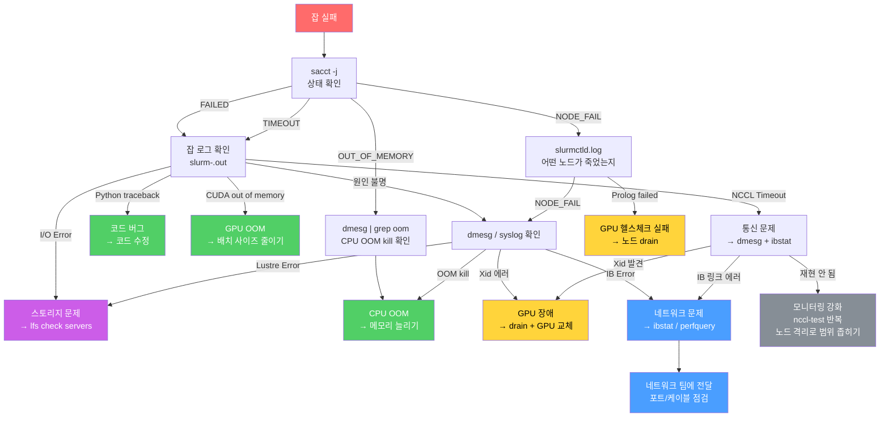

```mermaid
flowchart TD
    START["잡 실패"] --> SACCT["sacct -j <jobid><br/>상태 확인"]

    SACCT --> |"FAILED"| JOBLOG["잡 로그 확인<br/>slurm-<jobid>.out"]
    SACCT --> |"TIMEOUT"| JOBLOG
    SACCT --> |"OUT_OF_MEMORY"| DMESG_OOM["dmesg | grep oom<br/>CPU OOM kill 확인"]
    SACCT --> |"NODE_FAIL"| SLURMLOG["slurmctld.log<br/>어떤 노드가 죽었는지"]

    JOBLOG --> |"Python traceback"| FIX_CODE["코드 버그<br/>→ 코드 수정"]
    JOBLOG --> |"CUDA out of memory"| FIX_GPU_OOM["GPU OOM<br/>→ 배치 사이즈 줄이기"]
    JOBLOG --> |"NCCL Timeout"| NCCL_DEBUG["통신 문제<br/>→ dmesg + ibstat"]
    JOBLOG --> |"I/O Error"| STORAGE["스토리지 문제<br/>→ lfs check servers"]
    JOBLOG --> |"원인 불명"| DMESG["dmesg / syslog 확인"]

    DMESG_OOM --> FIX_CPU_OOM["CPU OOM<br/>→ 메모리 늘리기"]

    SLURMLOG --> |"NODE_FAIL"| DMESG
    SLURMLOG --> |"Prolog failed"| PROLOG["GPU 헬스체크 실패<br/>→ 노드 drain"]

    DMESG --> |"Xid 에러"| DRAIN["GPU 장애<br/>→ drain + GPU 교체"]
    DMESG --> |"OOM kill"| FIX_CPU_OOM
    DMESG --> |"Lustre Error"| STORAGE
    DMESG --> |"IB Error"| NETWORK["네트워크 문제<br/>→ ibstat / perfquery"]

    NCCL_DEBUG --> |"IB 링크 에러"| NETWORK
    NCCL_DEBUG --> |"Xid 발견"| DRAIN
    NCCL_DEBUG --> |"재현 안 됨"| MONITOR["모니터링 강화<br/>nccl-test 반복<br/>노드 격리로 범위 좁히기"]

    NETWORK --> NETTEAM["네트워크 팀에 전달<br/>포트/케이블 점검"]

    style START fill:#ff6b6b,color:#fff
    style FIX_CODE fill:#51cf66,color:#fff
    style FIX_GPU_OOM fill:#51cf66,color:#fff
    style FIX_CPU_OOM fill:#51cf66,color:#fff
    style DRAIN fill:#ffd43b,color:#000
    style PROLOG fill:#ffd43b,color:#000
    style STORAGE fill:#cc5de8,color:#fff
    style NETWORK fill:#4a9eff,color:#fff
    style NETTEAM fill:#4a9eff,color:#fff
    style MONITOR fill:#868e96,color:#fff
```
