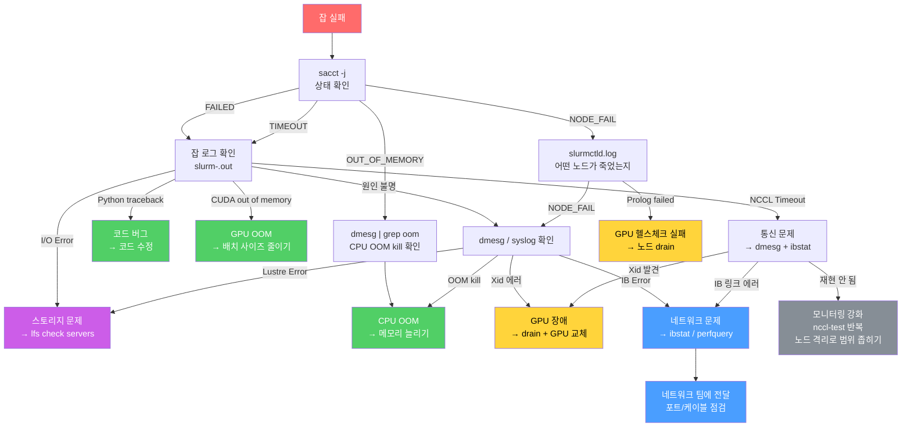
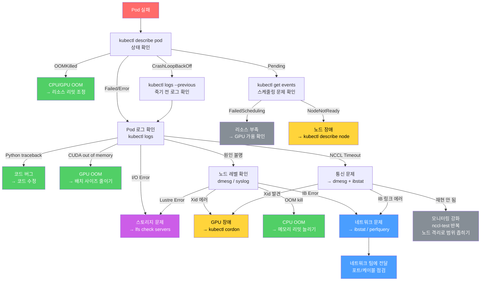

## 훈련작업 실패 디버깅 (장애 원인파악) ##

잡 실패 시 sacct로 상태 먼저 확인하고, 잡 로그에서 에러 메시지를 살펴본다. 대부분 여기서 원인이 나오는데, 안 보이면 dmesg에서 Xid나 OOM을 확인하고, 그래도 안 보이면 slurmctld 로그에서 스케줄링/노드 문제를 확인합니다. GPU 하드웨어 문제면 drain, OOM이면 리소스 조정, 네트워크면 ibstat으로 링크 상태 확인한다.

```
sacct -j 12345 --format=JobID,JobName,State,ExitCode,Elapsed,MaxRSS,NodeList

# JobID    JobName     State          ExitCode  Elapsed   MaxRSS    NodeList
# 12345    llm-train   FAILED         1:0       02:30:15  450G      gpu-node-[01-04]
```

```
잡 실패
  │
  ▼
sacct → 상태 확인 (FAILED/TIMEOUT/OOM/NODE_FAIL)
  │
  ▼
잡 로그 (slurm-<jobid>.out)
  ├─ Python traceback     → 코드 버그 → 코드 수정
  ├─ CUDA out of memory   → GPU OOM → 배치 사이즈 줄이기
  ├─ NCCL Timeout         → 통신 문제 → Step 3으로
  ├─ I/O Error            → 스토리지 문제 → lfs check servers
  └─ 원인 불명            → Step 3으로
  │
  ▼
dmesg / syslog
  ├─ Xid 에러             → GPU 장애 → drain + GPU 교체
  ├─ OOM kill             → CPU OOM → 메모리 늘리기
  ├─ Lustre Error         → 스토리지 → lfs 진단
  └─ IB Error             → 네트워크 → ibstat/perfquery
  │
  ▼
slurmctld.log
  ├─ NODE_FAIL            → 노드 장애
  └─ Prolog failed        → GPU 헬스체크 실패
```


## k8s ##

```
잡 실패
  │
  ▼
kubectl → 상태 확인
  kubectl get pods -n team-a
  kubectl describe pod train-job-worker-0
  # Status: Failed / Error / OOMKilled / CrashLoopBackOff
  │
  ▼
Pod 로그 (= Slurm 잡 로그)
  kubectl logs train-job-worker-0
  kubectl logs train-job-worker-0 --previous   # 죽기 전 로그
  ├─ Python traceback     → 코드 버그
  ├─ CUDA out of memory   → GPU OOM
  ├─ NCCL Timeout         → 통신 문제
  ├─ I/O Error            → 스토리지 문제
  └─ 원인 불명            → 아래로
  │
  ▼
노드 레벨 확인
  kubectl debug node/gpu-node-05 -it --image=ubuntu
  # 또는 SSH로 접속
  dmesg | grep -i "xid\|oom\|lustre"
  ├─ Xid 에러             → GPU 장애 → kubectl cordon
  ├─ OOM kill             → CPU OOM → 리소스 리밋 조정
  └─ IB Error             → 네트워크 → ibstat
  │
  ▼
K8s 이벤트 확인 (= slurmctld.log)
  kubectl get events -n team-a --sort-by='.lastTimestamp'
  # FailedScheduling → 리소스 부족
  # NodeNotReady     → 노드 장애
  # Evicted          → 리소스 초과로 퇴거
```

## 비교 ##
본질은 동일하다. 잡 로그 → 시스템 로그 → 스케줄러 로그 순서로 확인한다.


